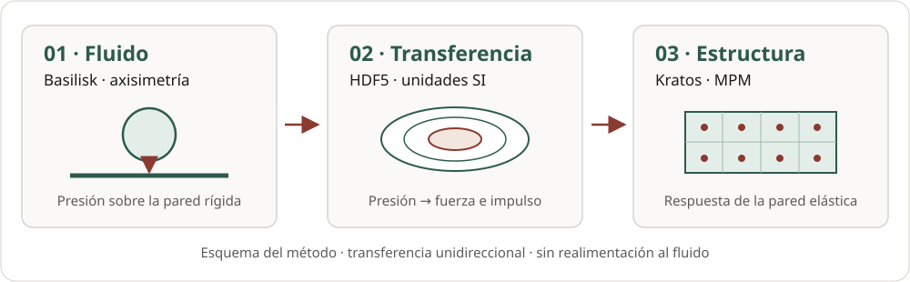

# Framework actual y plan de implementación de la pared MPM 2D

**Proyecto:** acoplamiento unidireccional Basilisk–Kratos MPM para cargas de
cavitación  
**Organización:** MC-Andes  
**Estado del documento:** especificación ejecutable del siguiente hito  
**Fecha de corte:** 2026-08-30  
**Versión objetivo:** v0.1.0  
**Solver sólido seleccionado:** Kratos Multiphysics MPMApplication 10.4.3

## 1. Propósito y conclusión operativa

Este documento describe de manera autocontenida el framework que ya existe y el
trabajo que falta para ejecutar la primera pared elástica con el Método de los
Puntos Materiales (MPM) en dos dimensiones. La decisión técnica principal es
usar una formulación **axisimétrica 2D** de Kratos, porque la carga disponible es
\(p(r,t)\). Una aproximación de deformación plana convertiría el problema en una
carga por unidad de espesor y ya no conservaría la fuerza axisimétrica
\(2\pi\int p\,r\,dr\); por tanto, solo se considerará más adelante como prueba
numérica separada y no como representación del colapso de burbuja.

El siguiente hito no consiste todavía en predecir erosión. Consiste en demostrar,
con una pared homogénea linealmente elástica, que:

1. el archivo \(p(r,t)\) se puede consumir sin ambigüedad;
2. Kratos recibe fuerzas en N, con signo, área e impulso correctos;
3. la pared 2D transmite y refleja ondas sin inestabilidad numérica;
4. la solución converge al refinar celda, paso temporal y puntos por celda;
5. los campos y las métricas se pueden inspeccionar en ParaView;
6. los balances de carga, impulso y energía quedan registrados automáticamente.

Hasta que esas seis condiciones se cumplan, los datos sintéticos son pruebas del
flujo de software, no resultados físicos de cavitación ni de daño.

## 2. Alcance físico y supuestos vigentes

El framework representa un acoplamiento secuencial de una sola vía:

~~~text
Basilisk 2D axisimétrico, pared rígida
  │
  ├─ presión manométrica promedio por anillo p̄(r,t)
  ├─ tracción cortante radial promedio τ̄(r,t)
  └─ metadatos de malla, EOS, caso y convergencia
  │
  ▼
HDF5 canónico wall-loads v1.1.0
  │
  ├─ auditoría de fuerza e impulso
  ├─ tabla derivada de fuerzas puntuales para Kratos
  └─ bundle VTK de la carga para ParaView
  │
  ▼
Kratos MPMApplication 10.4.3, pared 2D axisimétrica
  │
  ├─ desplazamiento, velocidad y tensión de los puntos materiales
  ├─ energía cinética, de deformación y trabajo externo
  └─ VTK/JSON, métricas y manifiesto reproducible
~~~

Los supuestos que limitan la interpretación son:

- una cavidad gaseosa aislada, sin nube de burbujas;
- pared rígida en la simulación fluida;
- presión transferida sin realimentación del movimiento de la pared;
- simetría alrededor del eje de la burbuja;
- carga normal definida sobre la superficie inicial, no *follower load*;
- un único impacto, insuficiente para predecir erosión acumulada;
- primera pared homogénea y elástica; plasticidad, gradación, daño y
  delaminación se habilitan por etapas después de verificar el caso base.

La primera corrida responde a «cómo se comporta la pared bajo una carga común
prescrita». No demuestra todavía cómo cambiaría la propia burbuja frente a una
pared deformable o de impedancia finita.

## 3. Estado verificable del repositorio

### 3.1 Componentes ya implementados

| Componente | Estado | Responsabilidad |
| --- | --- | --- |
| <code>WallLoadHistory</code> | implementado y probado | valida y escribe el HDF5 canónico de \(p(r,t)\) |
| esquema <code>wall-loads</code> 1.1.0 | implementado | define unidades, dimensiones, convenciones y procedencia |
| mapeo axisimétrico | implementado y probado | reconstruye \(r\), integra áreas y conserva fuerza global |
| <code>KratosLoadTable</code> | implementado y probado | guarda fuente y fuerzas MPM en un HDF5 autocontenido |
| promedio temporal por paso | implementado y probado | integra exactamente el interpolante lineal durante cada paso MPM |
| emparejamiento de condiciones | implementado y probado | asocia coordenadas iniciales uno a uno, sin depender de IDs generados |
| proceso Python de Kratos | implementado; falta corrida completa | asigna <code>POINT_LOAD</code> a condiciones MPM móviles |
| exportador ParaView de la carga | implementado y probado | produce animación de pared, mapa \(r-t\) e historia de fuerza |
| CI Python y documentación | implementado | lint, tipos, pruebas, cobertura, MkDocs y *smoke test* de importación Kratos |
| caso completo de pared 2D | **pendiente** | geometría, materiales, frontera, salida VTK y ejecución física |
| operador geométrico local anillo–parche | **pendiente** | conservación local de producción, más allá de la corrección global |
| caso Basilisk físico | **pendiente** | sustituir el pulso sintético por una carga convergida |

El ejemplo sintético actual tiene 101 tiempos, 40 anillos y, en su demostración
cartesiana 3D, 6400 puntos de carga. La tabla generada conserva la fuerza con un
error máximo relativo de \(3.707\times10^{-16}\), conserva el impulso a precisión
de máquina y requirió una corrección global relativa L2 máxima de
\(2.832\times10^{-3}\). Estos números verifican el adaptador, no la física del
impacto.

### 3.2 Estructura relevante

~~~text
.
├── coupling/schemas/
│   ├── wall-loads-v1.yaml
│   └── kratos-point-loads-v1.yaml
├── docs/
│   ├── framework-and-2d-roadmap.md        # este documento
│   └── assets/data-flow.svg
├── examples/
│   ├── synthetic_mapping.py
│   └── kratos_load_table.py
├── mpm/kratos/
│   ├── axisymmetric_hdf5_point_load_process.py
│   ├── ProjectParameters.load-process.json
│   └── cases/                             # aquí se añadirá la pared 2D
├── src/cavitation_coupling/
│   ├── schema.py
│   ├── mapping.py
│   ├── kratos.py
│   └── paraview_export.py
├── tests/
│   ├── test_schema.py
│   ├── test_mapping.py
│   ├── test_kratos.py
│   └── test_paraview_export.py
├── visualization/paraview/
│   ├── export_wall_loads.py
│   └── render_bundle.py
└── provenance/solvers.lock.yml
~~~

## 4. Contrato de datos \(p(r,t)\)

### 4.1 Archivo canónico de pared

El HDF5 <code>mc-andes-basilisk-wall-loads</code>, versión 1.1.0, es la fuente
de verdad. Las cantidades están en SI y la presión es manométrica, positiva en
compresión:

\[
p_g(r,t)=p_w(r,t)-p_{ref}.
\]

| Ruta HDF5 | Forma | Unidad | Significado |
| --- | ---: | --- | --- |
| <code>/time</code> | <code>(Nt,)</code> | s | tiempos estrictamente crecientes |
| <code>/coordinates/radial_edges</code> | <code>(Nr+1,)</code> | m | bordes de los anillos |
| <code>/fields/pressure_gauge</code> | <code>(Nt,Nr)</code> | Pa | promedio por área de cada anillo |
| <code>/fields/shear_radial</code> | <code>(Nt,Nr)</code> | Pa | tracción cortante radial promedio |
| <code>/derived/impulse_pressure</code> | <code>(Nr,)</code> | Pa s | integral temporal por anillo |
| <code>/derived/force_normal</code> | <code>(Nt,)</code> | N | fuerza axisimétrica integrada |

Para el anillo \(i=[r_i,r_{i+1}]\), el área física es

\[
A_i=\pi\left(r_{i+1}^2-r_i^2\right),
\qquad
F_B(t)=\sum_i \bar p_i(t)A_i.
\]

Guardar bordes y promedios, en lugar de centros y máximos de celda, permite
reconstruir exactamente fuerza e impulso aun si cambia la discretización sólida.
El archivo incluye <code>complete=true</code> solo después de terminar una
escritura atómica; el lector rechaza versiones mayores desconocidas y archivos
incompletos.

### 4.2 Archivo derivado para Kratos

El segundo HDF5, <code>mc-andes-kratos-mpm-point-loads</code> 1.0.0, conserva
una copia de la fuente y añade la discretización superficial elegida:

| Ruta HDF5 | Forma | Unidad | Significado |
| --- | ---: | --- | --- |
| <code>/source/time</code> | <code>(Nt,)</code> | s | tiempos de la fuente |
| <code>/source/radial_edges</code> | <code>(Nr+1,)</code> | m | anillos originales |
| <code>/source/pressure_gauge</code> | <code>(Nt,Nr)</code> | Pa | \(p(r,t)\) original |
| <code>/conditions/coordinates_initial</code> | <code>(Nc,3)</code> | m | posición inicial de cada condición |
| <code>/conditions/tributary_area</code> | <code>(Nc,)</code> | m² | área física representada |
| <code>/conditions/outward_normal</code> | <code>(Nc,3)</code> | 1 | normal exterior unitaria |
| <code>/loads/pressure_gauge</code> | <code>(Nt,Nc)</code> | Pa | presión reconstruida en condiciones |
| <code>/loads/point_force</code> | <code>(Nt,Nc,3)</code> | N | fuerza total que recibe Kratos |
| <code>/diagnostics/source_force</code> | <code>(Nt,)</code> | N | referencia integrada desde anillos |
| <code>/diagnostics/target_force</code> | <code>(Nt,)</code> | N | suma aplicada a las condiciones |

La convención vectorial es

\[
\mathbf f_a(t)=-p_a(t)A_a\mathbf n_a.
\]

<code>POINT_LOAD</code> recibe **N, no Pa**. La fuerza ya contiene
<code>tributary_area</code>; no se debe multiplicar de nuevo por
<code>MPC_AREA</code> ni por \(2\pi r\). Esta decisión responde a la
implementación de condiciones puntuales de partícula de Kratos 10.4.3: las
cargas distribuidas de línea y superficie sobre partículas no están
implementadas en esa ruta, mientras que la condición puntual usa área unitaria.

### 4.3 Sincronización temporal

Para un paso sólido \([t_n,t_{n+1}]\), el proceso aplica el promedio exacto del
interpolante lineal almacenado:

<!-- markdownlint-disable MD049 -->

\[
\bar{\mathbf f}^{\,n+1/2}_a =
\frac{1}{t_{n+1}-t_n}
\int_{t_n}^{t_{n+1}}\mathbf f_a(t)\,dt.
\]

<!-- markdownlint-enable MD049 -->

Esto conserva el impulso aunque un paso MPM cruce uno o varios tiempos del HDF5.
No se permite extrapolación. La simulación debe comenzar y terminar dentro del
intervalo de la tabla, incluyendo una línea base de carga cero antes y después
del pulso si la ventana estructural la necesita.

## 5. Diseño de la primera pared MPM 2D

### 5.1 Formulación seleccionada

Se usará un dominio meridional \((r,z)\), con \(r\ge0\),
<code>domain_size = 2</code> y <code>axis_symmetric_flag = true</code>. La ley
inicial será <code>LinearElasticIsotropicAxisym2DLaw</code>, presente en los
casos de prueba oficiales de Kratos 10.4.3. El solver será dinámico, explícito,
con diferencia central y actualización MUSL.

Una fila de <code>surface-points.csv</code> representará un anillo fuente. Para
evitar un punto exactamente en el eje, su coordenada radial se ubicará en el
centroide por área:

\[
r_i^*=\frac{2}{3}
\frac{r_{i+1}^3-r_i^3}{r_{i+1}^2-r_i^2},
\qquad A_i=\pi(r_{i+1}^2-r_i^2).
\]

Así, \(N_c=N_r\), cada punto cae dentro de su propio anillo y la suma de fuerzas
es localmente exacta para el caso alineado. El CSV tendrá:

~~~text
condition_id,x_m,y_m,z_m,area_m2,nx,ny,nz
~~~

Se adoptará inicialmente \(x=r\), \(y=z\), pared superior en \(z=0\), material
en \(z<0\) y normal exterior \(\mathbf n=(0,1,0)\). En la llamada al exportador,
los dos ejes del plano físico de pared serán \((1,0,0)\) y \((0,0,1)\); de este
modo, puntos \((r,0,0)\) tienen radio \(r\) y la normal calculada es paralela al
eje \(y\). Esta convención se fijará en una prueba antes de mallar el caso grande.

### 5.2 Geometría base

| Parámetro | Valor inicial | Estudio requerido |
| --- | ---: | --- |
| radio del material | 10 mm | 8, 10 y 12 mm |
| profundidad del material | 12 mm | 8, 12 y 16 mm |
| radio cargado | último borde de \(p(r,t)\) | igual a la fuente, sin extrapolar |
| tamaño de celda | 100 µm | 200, 100 y 50 µm |
| puntos por cuadrilátero | 4 | 1, 4 y 9 primero |
| ventana de análisis | 0–3 µs después del pulso | recortar antes del retorno de fronteras |

El grid de fondo debe extenderse al menos una celda fuera del volumen inicial en
la dirección en que puedan moverse las partículas. El archivo
<code>*_Body.mdpa</code> define la región material; <code>*_Grid.mdpa</code>
define el grid, las restricciones y las condiciones <code>Point3D</code> de
carga.

### 5.3 Material elástico inicial

Para aislar la integración se usará aluminio homogéneo nominal:

| Propiedad | Valor |
| --- | ---: |
| densidad \(\rho\) | 2700 kg/m³ |
| módulo de Young \(E\) | 68.9 GPa |
| razón de Poisson \(\nu\) | 0.33 |

La velocidad longitudinal estimada es

\[
c_L=\sqrt{\frac{E(1-\nu)}{\rho(1+\nu)(1-2\nu)}}
\approx6.15\ \text{km/s}.
\]

Con \(\Delta x=100\ \mu\text{m}\) y \(C_s=0.4\), el valor inicial es
\(\Delta t\lesssim6.5\ \text{ns}\). El paso definitivo será el menor entre el
límite estable medido y el necesario para resolver el pulso con al menos 20
pasos por FWHM. El pulso nunca se ensancha para estabilizar la solución.

### 5.4 Condiciones de frontera

- eje \(r=0\): desplazamiento y velocidad radial nulos;
- base \(z=-L_z\): restricción vertical para eliminar movimiento rígido;
- borde \(r=L_r\): rodillo radial en el caso base;
- superficie \(z=0\): libre fuera de \(R_{map}\) y cargada dentro de él;
- componente fuera del plano: restringida según la configuración 2D de Kratos.

Estas fronteras reflejan ondas. No se supondrá una frontera absorbente MPM que
no haya sido verificada. La ventana útil terminará antes de la primera reflexión
que pueda regresar a la región de interés; el estudio de \(L_r,L_z\) confirmará
esa separación.

## 6. Programa de pruebas por puertas

Las pruebas se ejecutan en orden. Una puerta fallida bloquea las etapas que
añaden complejidad física.

### P0. Entorno Kratos reproducible

#### Acciones

- ejecutar Linux x86-64 con Python 3.11 y Kratos MPMApplication 10.4.3;
- fijar wheel/commit, número de hilos OpenMP, CPU y comando;
- ejecutar un ejemplo axisimétrico oficial sin modificaciones;
- importar el proceso HDF5 del repositorio.

#### Aceptación

- imports y ejemplo oficial terminan con código 0;
- no hay versiones flotantes en el manifiesto;
- la CI conserva un *smoke test* mínimo de cada import.

### P1. Semántica de <code>POINT_LOAD</code> y del factor axisimétrico

#### Acciones

- construir un modelo mínimo con una sola condición <code>Point3D</code>;
- aplicar una fuerza constante conocida y medir reacción/cambio de momento;
- repetir con 2, 4 y 8 anillos bajo presión uniforme;
- comprobar \(F=p\pi R^2\) y que el resultado no escala otra vez con \(2\pi r\).

#### Aceptación

- error de fuerza e impulso menor que \(10^{-10}\) en el adaptador;
- error del runtime menor que \(10^{-8}\) o tolerancia explicada por el integrador;
- duplicar el número de anillos no cambia la fuerza total;
- presión positiva produce movimiento hacia el interior del sólido.

Esta es la prueba de mayor prioridad. Si falla, se corrige la representación de
la condición antes de crear el caso completo.

### P2. Pulso temporal no alineado

#### Acciones

- usar pulsos triangular y rectangular cuyos quiebres no coincidan con pasos MPM;
- comparar muestreo <code>linear</code> y <code>step_average</code>;
- integrar <code>diagnostics_csv</code> y el HDF5 fuente.

#### Aceptación

- <code>step_average</code> conserva el impulso a precisión de máquina en el
  adaptador;
- el runtime conserva el impulso con error menor que 0.1 %;
- no existe extrapolación silenciosa al inicio o al final.

### P3. Onda elástica 1D embebida en el dominio axisimétrico

#### Acciones

- aplicar un pulso radialmente uniforme sobre toda la cara superior;
- registrar llegada de onda a sondas de profundidad;
- comparar velocidad con \(c_L\) y, antes de reflexiones, impedancia
  \(\rho c_L\);
- revisar momento y energías.

#### Aceptación

- error de velocidad de onda menor que 2 % en la región de interés;
- residuo \(|E_k+E_e-W_{ext}-E_0|/E_{scale}<2\%\);
- ausencia de NaN, partículas perdidas y crecimiento no físico de energía.

### P4. Pared 2D bajo presión localizada

#### Acciones

- ejecutar primero una presión uniforme sobre disco y después un perfil radial
  cuadrático;
- ejecutar el pulso gaussiano sintético ya disponible;
- visualizar la propagación y la dispersión del frente de onda;
- verificar fuerza, impulso, desplazamiento máximo y simetría del eje.

#### Aceptación

- error global de fuerza e impulso menor que 1 %; objetivo algebraico
  \(10^{-10}\) cuando los anillos están alineados;
- desplazamiento radial en el eje compatible con cero;
- ninguna respuesta fuera de la ventana causal esperada;
- resultados rotulados explícitamente como sintéticos.

### P5. Convergencia MPM

Se cruzarán de forma secuencial, no en un factorial completo:

1. \(\Delta x=200,100,50\ \mu\text{m}\) con CFL y puntos/celda fijos;
2. \(C_s=0.4,0.2\) en las dos mallas finas;
3. 1, 4 y 9 puntos por cuadrilátero en la malla intermedia;
4. traslación del grid por media celda para revelar *grid crossing noise*;
5. radios y profundidades del dominio para separar reflexiones.

#### Aceptación

- cambio menor que 2 % entre las dos resoluciones más finas para llegada de onda
  y desplazamiento máximo filtrado;
- cambio menor que 5 % para tensión equivalente máxima filtrada;
- tendencia de convergencia documentada aun si un pico puntual no converge;
- la ventana reportada precede la primera reflexión de frontera.

### P6. Referencia independiente

Se aplicará la misma carga mapeada a un modelo lineal axisimétrico en FEniCSx o a
una solución analítica adecuada. Se compararán campos proyectados a una malla
común, no máximos singulares en puntos aislados.

#### Aceptación

- diferencia menor que 5 % en desplazamiento máximo y energía elástica;
- misma tendencia al refinar;
- norma L2 de desplazamiento y tensión reportada sobre una región común.

### P7. Sustitución por \(p(r,t)\) físico de Basilisk

Solo después de P0–P6 se reemplaza el pulso sintético por un HDF5 de Basilisk.
Ese archivo debe incluir commit del solver/exportador, EOS, \(R_0\), *stand-off*,
presión de referencia, niveles AMR, \(\Delta_{min}\), cadencia y estudio de
convergencia.

#### Aceptación

- carga fluida convergida en impulso y resolución temporal;
- fuerza/impulso conservados al mapear;
- interpretación limitada por los criterios de pared rígida y acoplamiento de
  una vía.

## 7. Archivos que debe producir el siguiente hito

~~~text
mpm/kratos/cases/elastic_axisymmetric_wall_2d/
├── MainKratos.py
├── ProjectParameters.json
├── ParticleMaterials.json
├── elastic_axisymmetric_wall_2d_Grid.mdpa
├── elastic_axisymmetric_wall_2d_Body.mdpa
├── surface-points.csv
├── generate_case.py
├── expected/
│   └── analytic-metrics.json
└── README.md

tests/
├── test_axisymmetric_surface.py
└── test_kratos_runtime.py             # marcado kratos

visualization/paraview/
├── render_mpm_wall.py
└── states/
    └── elastic-axisymmetric-wall.pvsm # generado/documentado, sin rutas locales
~~~

<code>generate_case.py</code> debe ser determinista y aceptar, al menos, tamaño
de celda, dimensiones, puntos por celda y HDF5 de carga. Los MDPA pequeños de
referencia pueden quedar versionados; las mallas de convergencia grandes se
regeneran y no se guardan en Git.

## 8. Configuración Kratos que se debe completar

El <code>ProjectParameters.json</code> debe contener, como mínimo:

~~~json
{
  "analysis_stage": "KratosMultiphysics.MPMApplication.mpm_analysis",
  "problem_data": {
    "parallel_type": "OpenMP",
    "start_time": 0.0,
    "end_time": 0.000003
  },
  "solver_settings": {
    "solver_type": "Dynamic",
    "domain_size": 2,
    "analysis_type": "linear",
    "time_integration_method": "explicit",
    "scheme_type": "central_difference",
    "stress_update": "musl",
    "axis_symmetric_flag": true,
    "pressure_dofs": false,
    "time_stepping": {"time_step": 6.0e-9}
  }
}
~~~

Los nombres finales de los submodelparts deben coincidir exactamente entre JSON
y MDPA. El fragmento ya disponible para la carga se incluye en
<code>processes.list_other_processes</code>:

~~~json
{
  "python_module": "axisymmetric_hdf5_point_load_process",
  "process_name": "AxisymmetricHdf5PointLoadProcess",
  "Parameters": {
    "model_part_name": "Background_Grid.CavitationLoad",
    "kratos_loads_hdf5": "cavitation.kratos-loads.v1.h5",
    "material_points_per_condition": 1,
    "time_sampling": "step_average",
    "coordinate_tolerance_m": 1e-10,
    "diagnostics_csv": "results/kratos-applied-loads.csv"
  }
}
~~~

El material inicial usa:

~~~json
{
  "constitutive_law": {"name": "LinearElasticIsotropicAxisym2DLaw"},
  "Variables": {
    "THICKNESS": 1.0,
    "MATERIAL_POINTS_PER_ELEMENT": 4,
    "DENSITY": 2700.0,
    "YOUNG_MODULUS": 68900000000.0,
    "POISSON_RATIO": 0.33
  }
}
~~~

<code>THICKNESS</code> es exigido por la entrada 2D, pero no debe
reinterpretarse como un segundo factor geométrico sobre la carga axisimétrica.
P1 demostrará esta semántica con el runtime seleccionado.

## 9. Salidas, métricas y visualización en ParaView

### 9.1 Carga antes de MPM

El exportador actual produce:

- <code>wall-pressure.pvd</code>: animación cartesiana de la presión;
- <code>radial-time.vtr</code>: mapa \(p(r,t)\) e impulso radial;
- <code>force-history.vtp</code>: \(F_z(t)\);
- <code>manifest.json</code>: caso, máximos, número de cuadros y advertencia de
  procedencia;
- <code>cavitation-wall-loads.pvsm</code> y una vista PNG al ejecutar
  <code>pvpython</code>.

### 9.2 Respuesta MPM

Se añadirá <code>MPMVtkOutputProcess</code> con salida binaria para ParaView. La
primera configuración solicitará variables disponibles en la release fijada:

- <code>MP_COORD</code>;
- <code>MP_DISPLACEMENT</code>;
- <code>MP_VELOCITY</code>;
- <code>MP_CAUCHY_STRESS_VECTOR</code>;
- <code>MP_ALMANSI_STRAIN_VECTOR</code>;
- <code>MP_EQUIVALENT_STRESS</code>;
- <code>MP_KINETIC_ENERGY</code>, <code>MP_STRAIN_ENERGY</code> y
  <code>MP_TOTAL_ENERGY</code> cuando la formulación las actualice de forma
  verificable.

Antes de etiquetar componentes \(rr,zz,\theta\theta,rz\), una prueba confirmará
el orden Voigt usado por la ley axisimétrica. No se inferirán nombres físicos por
posición sin esa comprobación.

El estado de ParaView del hito debe mostrar cuatro paneles reproducibles:

1. mapa fuente \(p(r,t)\) y fuerza total;
2. pared en la configuración deformada, coloreada por desplazamiento normal;
3. velocidad normal para observar el frente de onda;
4. tensión equivalente y gráficas de energía/carga contra tiempo.

Las deformaciones se mostrarán con un factor visual explícito. Capturas y videos
indicarán ese factor, tiempo físico, unidades, malla y que la carga es sintética o
física. La comparación entre casos usará el mismo rango de color.

### 9.3 Métricas mínimas por corrida

~~~text
case_id
git_commit
kratos_version
threads_openmp
cell_size_m
material_points_per_element
time_step_s
source_peak_pressure_pa
source_peak_force_n
source_impulse_n_s
applied_peak_force_n
applied_impulse_n_s
max_displacement_normal_m
max_velocity_normal_m_s
max_equivalent_stress_pa
kinetic_energy_j
strain_energy_j
external_work_j
energy_residual_relative
first_boundary_return_time_s
status
~~~

## 10. Lista priorizada de implementación

| ID | Prioridad | Tarea | Dependencia | Criterio de terminado |
| --- | --- | --- | --- | --- |
| T01 | P0 | crear entorno Linux Kratos 10.4.3 reproducible | ninguna | ejemplo axisimétrico oficial e imports pasan |
| T02 | P0 | generar cuadratura anular 2D y CSV | ninguna | \(A_i\), \(r_i^*\), signo y hashes tienen pruebas |
| T03 | P0 | construir caso mínimo de una condición | T01 | fuerza y cambio de momento coinciden |
| T04 | P0 | validar factor axisimétrico una sola vez | T02–T03 | \(F=p\pi R^2\) para 2/4/8 anillos |
| T05 | P0 | generar Grid.mdpa y Body.mdpa de pared | T01 | malla válida, eje/fronteras/submodelparts auditados |
| T06 | P0 | completar JSON de solver y material | T05 | corrida elástica corta termina sin NaN |
| T07 | P0 | conectar HDF5 al caso | T02–T06 | carga variable aplicada y CSV diagnóstico escrito |
| T08 | P1 | instrumentar impulso, momento y trabajo externo | T07 | métricas automáticas con unidades y tolerancias |
| T09 | P1 | añadir salida MPM VTK/JSON | T06 | serie abre en ParaView y contiene variables verificadas |
| T10 | P1 | ejecutar P2 y P3 | T08–T09 | impulso, onda y energía pasan sus puertas |
| T11 | P1 | ejecutar pulso sintético localizado | T10 | resultado 2D reproducible, visual y rotulado |
| T12 | P1 | automatizar matriz de convergencia | T11 | tabla comparativa y estado pass/fail |
| T13 | P2 | implementar referencia FEniCSx | T10 | comparación sobre malla común menor que 5 % |
| T14 | P2 | ejecutar \(p(r,t)\) físico Basilisk | T12–T13 | procedencia y convergencia completas |
| T15 | P3 | añadir recubrimiento/sustrato y gradación | T14 | recupera primero la respuesta homogénea |
| T16 | P3 | habilitar plasticidad verificada | T15 | benchmark constitutivo y balance energético pasan |

T01–T07 forman el siguiente Pull Request funcional. T08–T12 forman el Pull
Request de verificación y visualización. Esta separación mantiene revisiones
pequeñas y permite localizar fallos de solver, geometría, carga o postproceso.

## 11. Comandos reproducibles actuales

### 11.1 Desarrollo y pruebas Python

~~~bash
python3.11 -m venv .venv
source .venv/bin/activate
python -m pip install --upgrade pip
python -m pip install -e ".[dev,docs]"
ruff check .
ruff format --check .
mypy src
pytest
mkdocs build --strict
~~~

### 11.2 Generar \(p(r,t)\), tabla Kratos y visualización sintética

~~~bash
python examples/synthetic_mapping.py
python examples/kratos_load_table.py
cavitation-coupling results/synthetic-wall-loads.h5
cavitation-paraview-export \
  results/synthetic-wall-loads.h5 \
  results/paraview/synthetic-gaussian-pulse \
  --grid-points 101
~~~

En macOS con ParaView 6.1:

~~~bash
/Applications/ParaView-6.1.0.app/Contents/bin/pvpython \
  visualization/paraview/render_bundle.py \
  results/paraview/synthetic-gaussian-pulse
~~~

### 11.3 Ejecutar Kratos en Linux x86-64

~~~bash
python3.11 -m venv .venv
source .venv/bin/activate
python -m pip install --upgrade pip
python -m pip install -e ".[dev,kratos]"
export PYTHONPATH="$PWD/mpm/kratos:$PYTHONPATH"
cd mpm/kratos/cases/elastic_axisymmetric_wall_2d
python MainKratos.py ProjectParameters.json
~~~

Este último comando es el objetivo del siguiente hito; el directorio del caso
todavía no existe. El host macOS ARM actual no puede ejecutar el wheel Linux
x86-64 seleccionado, por lo que la prueba completa debe correr en CI, contenedor
o máquina Linux compatible.

## 12. Riesgos que deben permanecer visibles

| Riesgo | Diagnóstico | Respuesta |
| --- | --- | --- |
| doble factor \(2\pi r\) | fuerza cambia con radio/número de anillos | P1 con presión uniforme y suma analítica |
| presión Pa enviada como fuerza N | amplitud depende artificialmente de malla | HDF5 derivado solo expone <code>point_force</code> al proceso |
| normal o signo invertido | pared se mueve hacia el fluido | prueba de compresión positiva y convención única |
| orden de condiciones distinto | patrón espacial permutado | emparejamiento uno a uno por coordenada inicial |
| pulso submuestreado | pico/impulso cambia con \(\Delta t\) | promedio exacto y ≥20 pasos/FWHM |
| reflexión de fronteras | segunda llegada cambia con dominio | estudio \(L_r,L_z\) y recorte temporal |
| *grid crossing noise* | bandas dependen del grid | puntos/celda y traslación de media celda |
| energía no balanceada | crecimiento tras terminar la carga | trabajo externo discreto y residuo menor que 2 % |
| componente de tensión mal rotulada | mapas físicamente incoherentes | prueba del orden Voigt axisimétrico |
| resultado sintético sobreinterpretado | cifras presentadas como cavitación | advertencia en manifiestos, figuras y captions |
| pared rígida fuera de régimen | desplazamiento/velocidad alteran el hueco | limitar conclusión o migrar a acoplamiento bidireccional |

## 13. Definición de terminado del hito «pared MPM 2D»

El hito se considera completo únicamente cuando:

- [ ] existe un caso 2D axisimétrico ejecutable y documentado;
- [ ] la versión exacta de Kratos y el entorno Linux están fijados;
- [ ] <code>POINT_LOAD</code> y el factor axisimétrico pasan P1;
- [ ] pulsos no alineados conservan impulso;
- [ ] velocidad de onda y balance de energía pasan P3;
- [ ] el pulso sintético produce una respuesta estable y reproducible;
- [ ] se completaron refinamientos de malla, tiempo y puntos por celda;
- [ ] cada corrida escribe configuración, hashes, log, métricas y estado;
- [ ] ParaView muestra carga, desplazamiento, velocidad, tensión y energías;
- [ ] CI ejecuta pruebas Python y al menos una corrida Kratos pequeña;
- [ ] documentación y CHANGELOG.md reflejan capacidades y limitaciones;
- [ ] ninguna figura sintética se presenta como resultado físico.

## 14. Referencias técnicas auditadas

- [Kratos MPMApplication 10.4.3](https://github.com/KratosMultiphysics/Kratos/tree/v10.4.3/applications/MPMApplication).
- [Archivos de entrada de MPMApplication](https://kratosmultiphysics.github.io/Kratos/pages/Applications/MPM_Application/Input_Files/overview.html).
- [Configuración JSON de MPMApplication](https://kratosmultiphysics.github.io/Kratos/pages/Applications/MPM_Application/Input_Files/json.html).
- [Proceso Neumann de partículas en v10.4.3](https://github.com/KratosMultiphysics/Kratos/blob/v10.4.3/applications/MPMApplication/python_scripts/apply_mpm_particle_neumann_condition_process.py).
- [Generador de condiciones MPM en v10.4.3](https://github.com/KratosMultiphysics/Kratos/blob/v10.4.3/applications/MPMApplication/custom_utilities/material_point_generator_utility.cpp).
- [Salida VTK MPM en v10.4.3](https://github.com/KratosMultiphysics/Kratos/blob/v10.4.3/applications/MPMApplication/python_scripts/mpm_vtk_output_process.py).
- [Caso oficial explícito axisimétrico en v10.4.3](https://github.com/KratosMultiphysics/Kratos/tree/v10.4.3/applications/MPMApplication/tests/explicit_tests/axisymmetric_disk).
- [Normas de desarrollo de MC-Andes](https://github.com/MC-Andes/standards).

Las revisiones exactas auditadas están en
<code>provenance/solvers.lock.yml</code>. Una revisión consultada no se marca
como revisión de simulación hasta ejecutar un caso y guardar su manifiesto.
